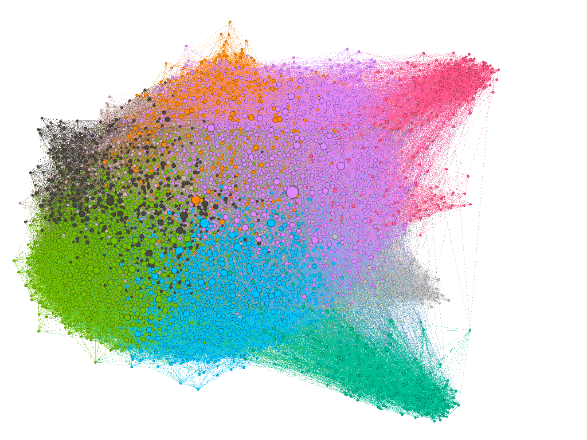

_Graph Machine Learning with a pure and refreshing breeze from the North pole._

We gather regularly to discuss the latest trends in graph machine learning, brainstorm new methods for graph data analysis and organize workshops or lectures around graphs and machine learning. Topics we are interested in: Graph machine learning, Graph data analysis, graph signal processing, network science, graph theory, graph visualization and other graph-related themes.

The core team is at the [University of Tromsø](https://en.uit.no/), the Arctic University of Norway, but we have members from all around the world.

If you want to join and be informed about our activities, contact us.

See our [Events page](events.md) for the next events we organize, and the past ones.

{: .align-center style="width: 10%;"}

